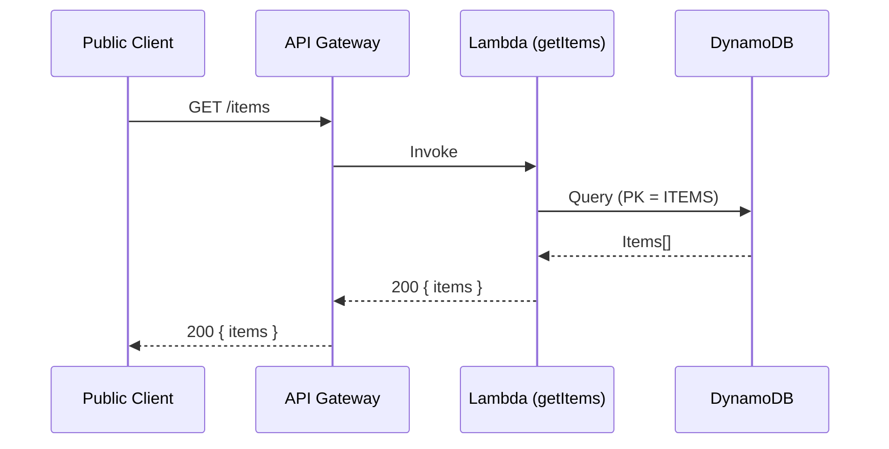
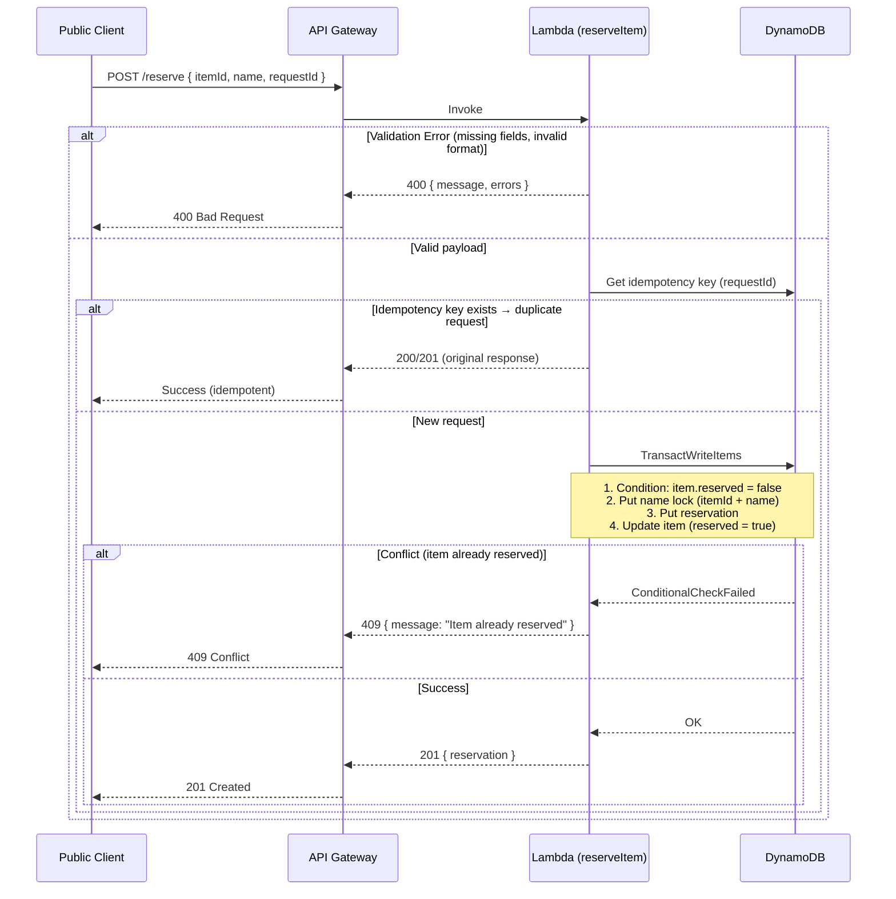
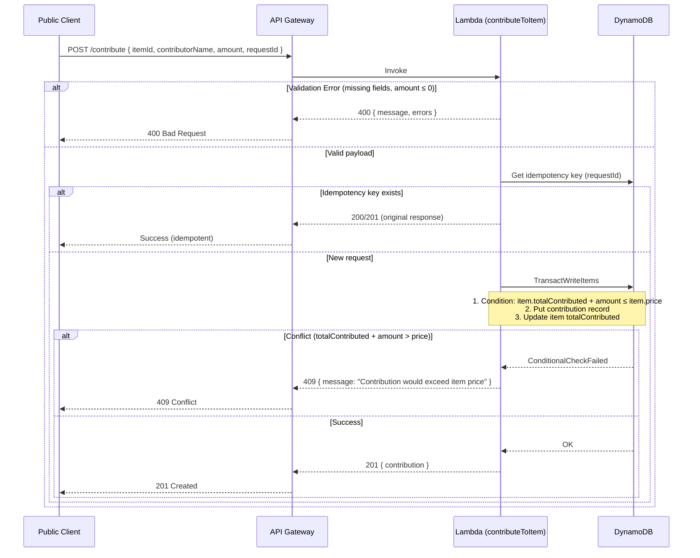
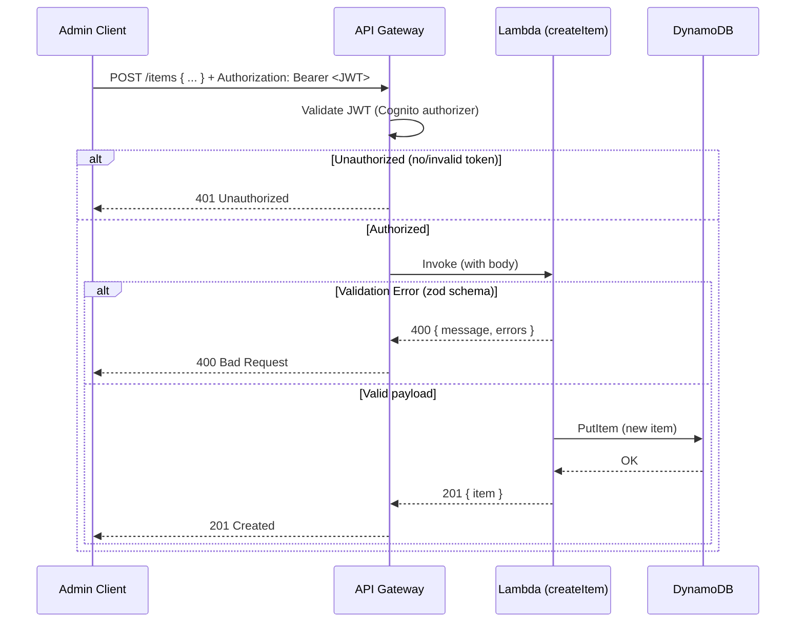
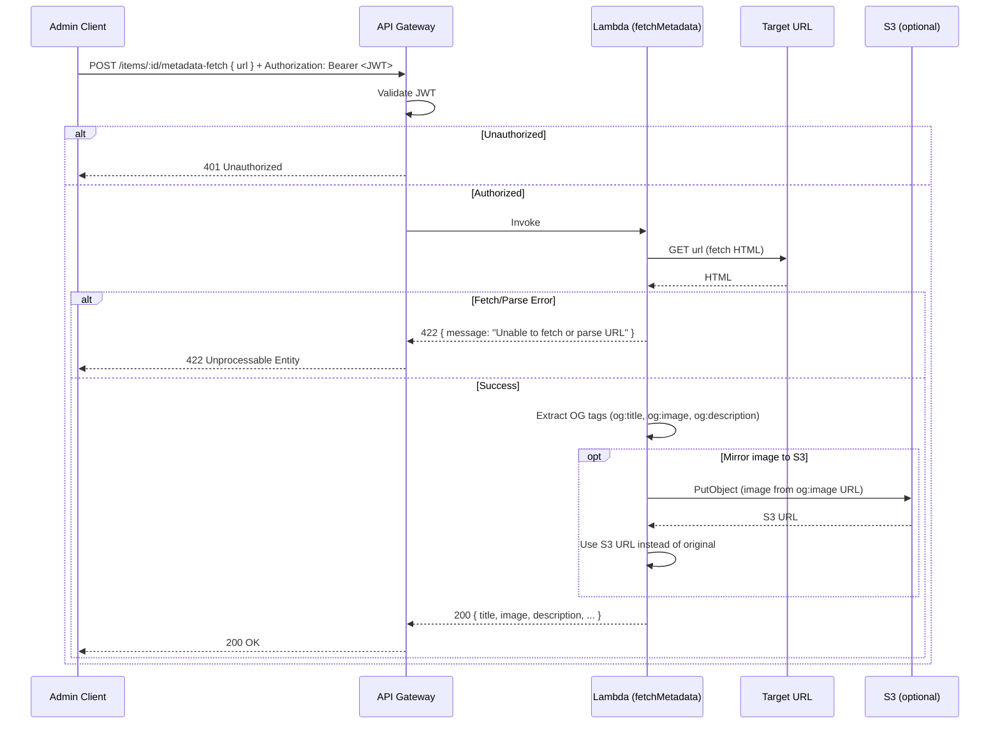

# Rainbow Cloud House Wishlist — System Sequences

Critical flows described as Mermaid sequence diagrams. Error paths (409 conflict, 400 validation, 422 unprocessable) are included where applicable.

---

## 1. Public: View Wishlist



---

## 2. Public: Reserve Item



---

## 3. Public: Contribute to Item



---

## 4. Admin: Add Item



---

## 5. Admin: Metadata Fetch



---

## 6. Admin: Upload Image

```mermaid
sequenceDiagram
    participant Client as Admin Client
    participant APIGW as API Gateway
    participant Lambda as Lambda (getPresignedUploadUrl)
    participant S3 as S3

    Client->>APIGW: POST /items/:id/upload-url (or /upload-url) + Authorization: Bearer <JWT>
    APIGW->>APIGW: Validate JWT
    alt Unauthorized
        APIGW-->>Client: 401 Unauthorized
    else Authorized
        APIGW->>Lambda: Invoke

        Lambda->>Lambda: Generate presigned PUT URL (content-type, key)
        Lambda->>S3: (no direct call; URL pre-signed)
        Lambda-->>APIGW: 200 { uploadUrl, expiresIn }
        APIGW-->>Client: 200 { uploadUrl }

        Note over Client,S3: Client uploads file directly to S3 (no Lambda in path)
        Client->>S3: PUT uploadUrl (file body)
        S3-->>Client: 200 OK

        Client->>APIGW: POST /items { imageUrl: <S3 URL> } or PUT /items/:id { imageUrl }
        Note over Client,APIGW: Item create/update includes the S3 URL
    end
```

---

## Error Summary

| HTTP | Use Case |
|------|----------|
| **400** | Validation errors (missing/invalid fields, schema violations) |
| **401** | Missing or invalid JWT (admin endpoints) |
| **409** | Conflict: item already reserved, contribution exceeds price, or similar invariant violation |
| **422** | Unprocessable: e.g. metadata fetch failed, URL unreachable |
